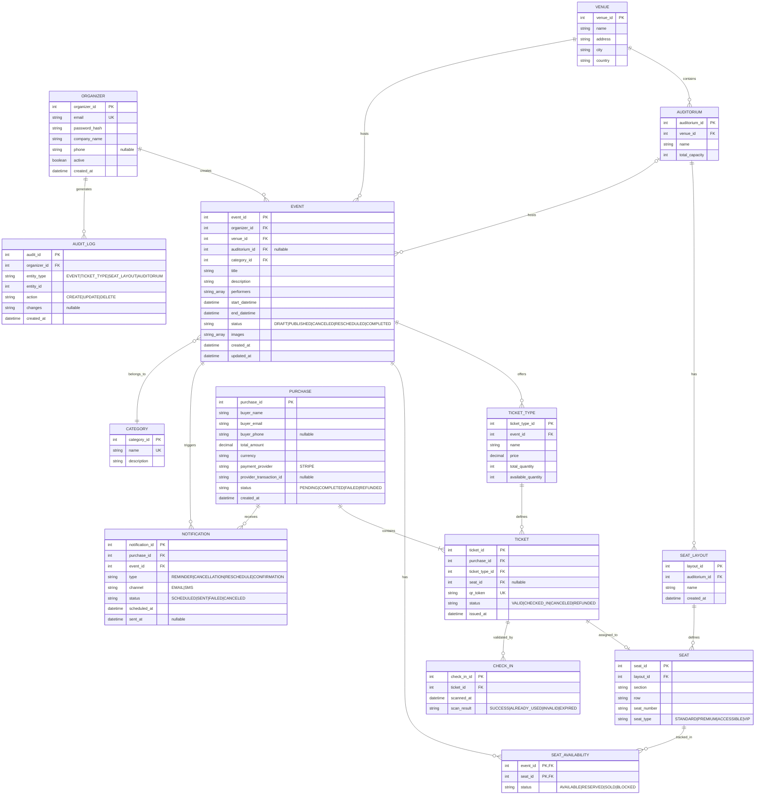

# Data Object

```mermaid
erDiagram
    ORGANIZER ||--o{ EVENT : creates
    ORGANIZER ||--o{ AUDIT_LOG : generates
    ORGANIZER {
        int organizer_id PK
        string email UK
        string password_hash
        string company_name
        string phone "nullable"
        boolean active
        datetime created_at
    }

    VENUE ||--o{ AUDITORIUM : contains
    VENUE {
        int venue_id PK
        string name
        string address
        string city
        string country
    }

    AUDITORIUM ||--o{ SEAT_LAYOUT : has
    AUDITORIUM |o--o{ EVENT : hosts
    AUDITORIUM {
        int auditorium_id PK
        int venue_id FK
        string name
        int total_capacity
    }

    VENUE ||--o{ EVENT : hosts

    SEAT_LAYOUT ||--o{ SEAT : defines
    SEAT_LAYOUT {
        int layout_id PK
        int auditorium_id FK
        string name
        datetime created_at
    }

    SEAT ||--o{ SEAT_AVAILABILITY : tracked_in
    SEAT {
        int seat_id PK
        int layout_id FK
        string section
        string row
        string seat_number
        string seat_type "STANDARD|PREMIUM|ACCESSIBLE|VIP"
    }

    EVENT ||--o{ TICKET_TYPE : offers
    EVENT ||--o{ SEAT_AVAILABILITY : has
    EVENT ||--o{ NOTIFICATION : triggers
    EVENT }o--|| CATEGORY : belongs_to
    EVENT {
        int event_id PK
        int organizer_id FK
        int venue_id FK
        int auditorium_id FK "nullable"
        int category_id FK
        string title
        string description
        string_array performers
        datetime start_datetime
        datetime end_datetime
        string status "DRAFT|PUBLISHED|CANCELED|RESCHEDULED|COMPLETED"
        string_array images
        datetime created_at
        datetime updated_at
    }

    CATEGORY {
        int category_id PK
        string name UK
        string description
    }

    TICKET_TYPE ||--o{ TICKET : defines
    TICKET_TYPE {
        int ticket_type_id PK
        int event_id FK
        string name
        decimal price
        int total_quantity
        int available_quantity
    }

    SEAT_AVAILABILITY {
        int event_id PK,FK
        int seat_id PK,FK
        string status "AVAILABLE|RESERVED|SOLD|BLOCKED"
    }

    PURCHASE ||--|{ TICKET : contains
    PURCHASE ||--o{ NOTIFICATION : receives
    PURCHASE {
        int purchase_id PK
        string buyer_name
        string buyer_email
        string buyer_phone "nullable"
        decimal total_amount
        string currency
        string payment_provider "STRIPE"
        string provider_transaction_id "nullable"
        string status "PENDING|COMPLETED|FAILED|REFUNDED"
        datetime created_at
    }

    TICKET ||--o| SEAT : assigned_to
    TICKET ||--o{ CHECK_IN : validated_by
    TICKET {
        int ticket_id PK
        int purchase_id FK
        int ticket_type_id FK
        int seat_id FK "nullable"
        string qr_token UK
        string status "VALID|CHECKED_IN|CANCELED|REFUNDED"
        datetime issued_at
    }

    CHECK_IN {
        int check_in_id PK
        int ticket_id FK
        datetime scanned_at
        string scan_result "SUCCESS|ALREADY_USED|INVALID|EXPIRED"
    }

    NOTIFICATION {
        int notification_id PK
        int purchase_id FK
        int event_id FK
        string type "REMINDER|CANCELLATION|RESCHEDULE|CONFIRMATION"
        string channel "EMAIL|SMS"
        string status "SCHEDULED|SENT|FAILED|CANCELED"
        datetime scheduled_at
        datetime sent_at "nullable"
    }

    AUDIT_LOG {
        int audit_id PK
        int organizer_id FK
        string entity_type "EVENT|TICKET_TYPE|SEAT_LAYOUT|AUDITORIUM"
        int entity_id
        string action "CREATE|UPDATE|DELETE"
        string changes "nullable"
        datetime created_at
    }
```